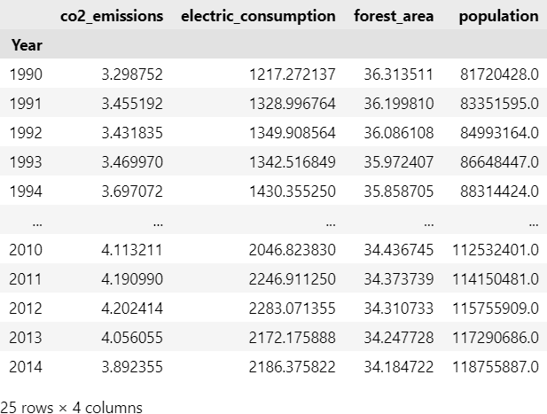
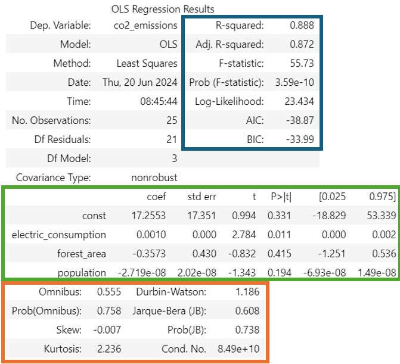

# Linear Regression

Linear regression is one of the simplest methods in Supervised Learning for Regression. It is used to predict the value of a dependent variable based on the value of one or more independent variables.


For this exercise, it will be used a dataset containing yearly observations from c02 emissions, electric consumption, forest area, and population in Mexico. The goal is to predict the c02 emissions based on the electric consumption, forest area, and population.




A linear regression consists in finding the best line that fits the data. The equation of a line is given by:

$$ y = mx + b $$

Where:

- $y$ is the dependent variable
- $x$ is the independent variable
- $m$ is the slope of the line
- $b$ is the intercept

In this case, since there are multiple independent variables, the equation of the line is given by:

$$ y = b_0 + b_1x_1 + b_2x_2 + ... + b_nx_n $$

Where:

- $y$ is the dependent variable
- $x_1, x_2, ..., x_n$ are the independent variables
- $b_1, b_2, ..., b_n$ are the coefficients
- $b_0$ is the intercept

However, how do we find the best line that fits the data? The answer is by minimizing the sum of squared residuals. The sum of squared residuals is the sum of the squared differences between the actual value of the dependent variable and the predicted value of the dependent variable. The best line is the one that minimizes this sum.

$$ SS_{res} = \sum_{i=1}^{n} (y_i - \hat{y_i})^2 $$

Where:

- $SS_{res}$ is the sum of squared residuals
- $y_i$ is the actual value of the dependent variable
- $\hat{y_i}$ is the predicted value of the dependent variable

The best line is the one that minimizes the sum of squared residuals. This can be done by calculating the partial derivative of the sum of squared residuals with respect to each coefficient and setting it to 0. The solution to this system of equations is given by:

$$ \hat{b} = (X^TX)^{-1}X^TY $$

Where:

- $\hat{b}$ is the vector of coefficients
- $X$ is the matrix of independent variables
- $Y$ is the vector of dependent variables

## Solving the linear regression

The solution can be made 'by hand' (doing the calculus in python) or using a library (statsmodels). In this case it will be shown both of them.

For this, let's first load the data and import the necessary libraries.

```python
import pandas as pd
import numpy as np
import statsmodels.api as sm

df_mexico= pd.read_csv('mexico.csv')
X= df_mexico[['electric_consumption', 'forest_area', 'population']]
X= sm.add_constant(X)
Y= df_mexico['co2_emissions']
```

### By hand

```python
X_squared= np.dot(X.T, X)
X_squared_inv= np.linalg.inv(X_squared)
mult_x= np.dot(X_squared_inv, X.T)
coefficients= np.dot(mult_x, Y)
```

The coefficients are:

- Intercept: 17.255
- Electric consumption: 0.001
- Forest area: -0.357
- Population: -2.719e-08

Which can be expressed as:

$$ co2\_emissions = 17.255 + 0.001 \times electric\_consumption - 0.357 \times forest\_area - 2.719e-08 \times population $$

To make predictions, it can be used te equation above

```python
y_pred = (coefficients[0] + \
          coefficients[1] * df_mexico['electric_consumption'] + \
          coefficients[2] * df_mexico['forest_area'] + \
          coefficients[3] * df_mexico['population'])
```

### Using statsmodels

All this process can be simplified using the statsmodels library. The code below shows how to do it.

```python
X= df_mexico[['electric_consumption', 'forest_area', 'population']]
Y= df_mexico['co2_emissions']
X= sm.add_constant(X)
model= sm.OLS(Y, X).fit()
y_pred= model.predict(X)
```

This code will return the same coefficients as the previous code, and also a summary statistics of the model.



This results can be divided into 3 categories: Summary of the model (blue) summary of the coefficients (green) and summary of the residuals (red).

## Interpretation of results

As stablished earlier, there are 3 types of results that can be obtained from a linear regression model: Summary of the model, summary of the coefficients, and summary of the residuals. The first one is a general overview of the model, which are used to determine if the model is statistically significant amd even compare the model to others. The second one is used to determine the relationship between the independent variables and the dependent variable. The third one is used to determine if the residuals are normally distributed and if there is autocorrelation between them, which is important to determine if the model is valid. 

### Summary of the model

#### R Squared

**What is?** R squared is a statistical measure that represents the proportion of the variance for a dependent variable that's explained by an independent variable. 

$$ R^2 = 1 - \frac{SS_{res}}{SS_{tot}} $$

Where: 
- $SS_{res}$ is the sum of squared residuals
- $SS_{tot}$ is the total sum of squares


**What does its value mean?** **The closer the value is to 1, the better the model is at explaining the variance in the dependent variable**. If the value is 0, the model is not able to explain the variance in the dependent variable. Usually, a value of 0.7 or higher is considered a good model.

```python
residuals= Y - y_pred
ssr= np.dot(residuals, residuals)
sst= np.dot((Y - Y.mean()), (Y - Y.mean()))
r_squared= 1 - (ssr/sst)
```

#### Adjusted R Squared

**What is?** Adjusted R Squared is a statistical measure that adjusts the R Squared value by the number of independent variables in the model.

$$ R^2_{adj} = 1 - \frac{SS_{res}/(n-p-1)}{SS_{tot}/(n-1)} $$

Where:
- $n$ is the number of observations
- $p$ is the number of independent variables

**What does its value mean?** As well as the R squared, the closer the value is to 1, the better the model is at explaining the variance in the dependent variable. However, the adjusted R squared penalizes the model for having more independent variables. This means that **the adjusted R squared is a better measure of the model's performance when comparing models with different numbers of independent variables**.


```python
n= len(Y)
p= X.shape[1]-1
r_squared_adj= 1 - (ssr/(n-p-1))/(sst/(n-1))
```

#### F Statistic

**What is?** The F statistic is a measure that tells you if you have a statistically significant model. Or in other words, it tells you if at least one of the independent variables is significantly related to the dependent variable. Commonly, this statistic is not interpretable on its own, but it is used to calculate the p-value.

$$ F = \frac{MSE_{model}}{MSE_{res}} $$

$$ p-value = F_{value}(k, df_{residuals}) $$

Where:

- $MSE_{model}$ is the mean squared error of the model
- $MSE_{res}$ is the mean squared error of the residuals
- $k$ is the number of independent variables
- $df_{residuals}$ is the degrees of freedom of the residuals

**What does its value mean?** Usually, the F statistic is compared to a critical value to determine if the model is statistically significant. If the p-value is less than a significance level, the model is statistically significant. In other words, **if the p-value is less than 0.05, there is at least one independent variable that is significantly related to the dependent variable**.


```python
explained_sum_squares= sst - ssr
mse_model= explained_sum_squares/k
mse_res= ssr/(n-k-1)
f_statistic= mse_model/mse_res
p_value= stats.f.sf(f_statistic, k, n-k-1)
```

#### Log Likelihood

**What is?** The log likelihood is a measure that tells you how well the model predicts the dependent variable. The higher the value, the better the model is at predicting the dependent variable. It is more commonly used for the calculation of the AIC and BIC.

$$ LL = -\frac{n}{2} \log(2\pi) - \frac{n}{2} \log(\sigma^2) - \frac{1}{2\sigma^2} \sum_{i=1}^{n} (y_i - \hat{y_i})^2 $$

Where:

- $n$ is the number of observations
- $\sigma^2$ is the variance of the residuals
- $y_i$ is the actual value of the dependent variable
- $\hat{y_i}$ is the predicted value of the dependent variable

**What does its value mean?** The higher the value, the better the model is at predicting the dependent variable.

```python
log_likelihood= -n/2 * np.log(2*np.pi) - n/2 * np.log(np.var(residuals)) \
    - 1/(2*np.var(residuals)) * np.dot(residuals, residuals)
```

#### AIC (Akaike Information Criterion)

**What is?** The AIC is a measure that tells you how well the model predicts the dependent variable while taking into account the number of independent variables in the model. 

$$ AIC = -2LL + 2k $$

Where:

- $LL$ is the log likelihood
- $k$ is the number of independent variables

**What does its value mean?** The lower the value, the better the model is at predicting the dependent variable while taking into account the number of independent variables in the model. This is useful to compare models with different numbers of independent variables.

```python
aic= -2*log_likelihood + 2*(k-1)
```

#### BIC

**What is?** The Bayesian Information Criterion is a measure that tells you how well the model predicts the dependent variable while taking a stronger penalty for the number of independent variables in the model.

$$ BIC = -2LL + k \log(n) $$

Where:

- $LL$ is the log likelihood
- $k$ is the number of independent variables
- $n$ is the number of observations

**What does its value mean?** The lower the value, the better the model is at predicting the dependent variable while taking into account the number of independent variables in the model. This is useful when is needed a strong penalty for the number of independent variables in the model.

```python
bic= -2*log_likelihood + k*np.log(n)
```

### Summary of the coefficients

#### Coefficients

**What is?** The coefficients are the values that tell you how much the dependent variable changes for a one-unit change in the independent variable.

$$ \hat{b} = (X^TX)^{-1}X^TY $$

Where:

- $\hat{b}$ is the vector of coefficients
- $X$ is the matrix of independent variables
- $Y$ is the vector of dependent variables

**What does its value mean?** The higher the value, the more the dependent variable changes for a one-unit change in the independent variable.

```python
X_squared= np.dot(X.T, X)
X_squared_inv= np.linalg.inv(X_squared)
mult_x= np.dot(X_squared_inv, X.T)
coefficients= np.dot(mult_x, Y)
```


#### Standard Error of the Coefficients

**What is?** The standard error of the coefficients is a measure that tells you how much the coefficient varies from the true value.

$$ SE = \sqrt{\frac{SS_{res}}{n-k-1} \times (X^TX)^{-1}} $$

Where:

- $SE$ is the standard error of the coefficients
- $SS_{res}$ is the sum of squared residuals
- $n$ is the number of observations
- $k$ is the number of independent variables
- $X$ is the matrix of independent variables

**What does its value mean?** The lower the value, the more accurate the coefficient is.

```python
se= np.sqrt(ssr/(n-k-1) * np.diag(np.linalg.inv(np.dot(X.T, X))))
```

#### T Statistic, P-Value, and Confidence Interval of the Coefficients

**What is?** The T statistic is a measure that tells you if the coefficient is significantly different from 0. The p-value is a percentage interpretation of the T statistic. The confidence interval tells you how confident you are that the true value of the coefficient is within that range.

$$ T = \frac{b_i}{SE_i} $$
$$ p-value = T_{value}(df_{residuals}) $$
$$ CI = b_i \pm t_{\alpha/2} \times SE_i $$

Where:

- $T$ is the T statistic
- $p-value$ is the p-value
- $CI$ is the confidence interval
- $b_i$ is the coefficient
- $SE_i$ is the standard error of the coefficient
- $df_{residuals}$ is the degrees of freedom of the residuals
- $t_{\alpha/2}$ is the t-value for a given significance level

**What does its value mean?** If the p-value is less than a significance level (usually 0.05), the coefficient is significantly different from 0. The confidence interval tells you how confident you are that the true value of the coefficient is within that range. Usually, if the interval does not contain 0, the coefficient is significantly different from 0.

```python
t_statistic= coefficients/se
p_value= stats.t.sf(np.abs(t_statistic), n-k-1)*2
ci= np.array([coefficients - stats.t.ppf(0.975, n-k-1)*se, \
    coefficients + stats.t.ppf(0.975, n-k-1)*se]).T
```

### Summary of the residuals

#### Omnitest and p-value

**What is?** The omnitest is a measure that tells you if the model is valid by checking if the residuals are normally distributed. The p-value is a percentage interpretation of the omnitest.

This can be calculated with a normality test.

**What does its value mean?** If the p-value is less than a significance level (usually 0.05), the residuals are not normally distributed. If the p-value is greater than a significance level, the residuals are normally distributed.

```python
omnibus= stats.normaltest(residuals)
```

#### Skewness

**What is?** The skewness is a measure that tells you if the residuals are symmetrically distributed. In other words, it shows if the residuals have a bias to the left or to the right.

$$ Skewness = \frac{\sum_{i=1}^{n} (e_i - \bar{e})^3}{n \times \sigma^3} $$

Where:

- $Skewness$ is the skewness
- $e_i$ is the residual at time $i$
- $\bar{e}$ is the mean of the residuals
- $\sigma$ is the standard deviation of the residuals

**What does its value mean?** If the value is 0, the residuals are symmetrically distributed. If the value is less than 0, the residuals are skewed to the left. If the value is greater than 0, the residuals are skewed to the right.

```python
skewness= np.sum((residuals - residuals.mean())**3)/ \
    (n * residuals.std()**3)
```

#### Kurtosis

**What is?** The kurtosis is a measure that tells you if the residuals are heavy-tailed or light-tailed. In other words, it shows if the residuals have more or fewer extreme values than a normal distribution.

$$ Kurtosis = \frac{\sum_{i=1}^{n} (e_i - \bar{e})^4}{n \times \sigma^4} $$

Where:

- $Kurtosis$ is the kurtosis
- $e_i$ is the residual at time $i$
- $\bar{e}$ is the mean of the residuals
- $\sigma$ is the standard deviation of the residuals

**What does its value mean?** If the value is 3, the residuals have the same kurtosis as a normal distribution. If the value is less than 3, the residuals are light-tailed. If the value is greater than 3, the residuals are heavy-tailed.

```python
kurtosis= np.sum((residuals - residuals.mean())**4)/ \
    (n * residuals.std()**4)
```

#### Durbin-Watson

**What is?** The Durbin-Watson test is a measure that tells you if the residuals are autocorrelated. By autocorrelated, it means that the residuals are correlated with each other. This is important because if the residuals are autocorrelated, the model is not valid because it assumes that the residuals are independent.

$$ Durbin-Watson = \frac{\sum_{i=2}^{n} (e_i - e_{i-1})^2}{\sum_{i=1}^{n} e_i^2} $$

Where:

- $Durbin-Watson$ is the Durbin-Watson test
- $e_i$ is the residual at time $i$

**What does its value mean?** If the value is 2, the residuals are not autocorrelated. If the value is less than 2, the residuals are positively autocorrelated. If the value is greater than 2, the residuals are negatively autocorrelated.

```python
durbin_watson= np.sum(np.diff(residuals)**2)/ssr
```

#### Jarque-Bera and p-value

**What is?**  The Jarque-Bera test is a measure that tells you if the residuals are normally distributed. The difference between the Jarque-Bera test and the omnitest is that the Jarque-Bera test takes into account the skewness and kurtosis of the residuals. And the p-value is a percentage interpretation of the Jarque-Bera test.

$$ Jarque-Bera = \frac{n-k}{6} \times (S^2 + \frac{(K-3)^2}{4}) $$

P value using chi2 distribution

$$ p-value = 1 - \chi^2_{value}(Jarque-Bera, 2) $$

Where:

- $Jarque-Bera$ is the Jarque-Bera test
- $n$ is the number of observations
- $k$ is the number of independent variables
- $Skewness$ is the skewness
- $Kurtosis$ is the kurtosis

**What does its value mean?** If the p-value is less than a significance level (usually 0.05), the residuals are not normally distributed. If the p-value is greater than a significance level, the residuals are normally distributed.

```python
jarque_bera= n/6 * (skewness**2 + 1/4 * (kurtosis-3)**2)
prob_jb= stats.chi2.sf(jarque_bera, 2)
```

#### Condition Number

**What is?** The condition number is a measure that tells you if the independent variables are correlated. This problem is called multicollinearity, an ideal model should have independent variables that are not correlated. 

$$ Condition Number = \frac{\lambda_{max}}{\lambda_{min}} $$

Where:

- $Condition Number$ is the condition number
- $\lambda_{max}$ is the maximum eigenvalue of the matrix of independent variables
- $\lambda_{min}$ is the minimum eigenvalue of the matrix of independent variables

**What does its value mean?** If the value is less than 30, the independent variables are not correlated. If the value is greater than 30, the independent variables are correlated.

```python
eigenvalues= np.linalg.eigvals(np.dot(X.T, X))
condition_number= np.sqrt(eigenvalues.max()/eigenvalues.min())
```

## Summary of the results

To sum up, these are the key points to analyze the results of a linear regression model:

To check if the model is valid:
- The residuals should be normally distributed. Which is checked by the omnitest and the Jarque-Bera test **(p-value > 0.05)**.
- The residuals should not be autocorrelated. Which is checked by the Durbin-Watson test **(2)**.
- The independent variables should not be correlated. Which is checked by the condition number **(<30)**.

To check if the coefficients are significant:
- The p-value of the coefficients should be less than a significance level **(<0.05)**.
- The confidence interval of the coefficients should be significant **(not containing 0)**.

To check the performance of the model:
- The R squared should be high **(>0.7 approximately)**.
- F Statistic shows if at least one of the independent variables is significant **(p-value < 0.05)**.

To compare models:
- The model with the higher adjusted R squared is the best model.
- The model with the lower AIC and BIC is the best model when penalyzing the number of independent variables.


## Visualization

Once the model is built, it is important to visualize the results. This can be done by plotting the actual values of the dependent variable against the predicted values of the dependent variable. It will be used plotly for this.

```python
import plotly.express as px
import plotly.graph_objects as go
df_plot= pd.concat([X, Y, y_pred], axis=1, ignore_index=True)
df_plot.columns= X.columns.tolist() + ['y', 'y_pred']
df_plot= df_plot.drop('const', axis=1)
df_plot= df_plot.melt(id_vars=['y', 'y_pred'], var_name='Variable', value_name='Value')
df_plot
```

```python
fig= px.scatter(df_plot, x='y', y='y_pred', title='Actual vs Predicted Values')
fig.add_trace(px.line(x=[df_plot['y'].min(), df_plot['y'].max()], y=[df_plot['y'].min(), df_plot['y'].max()]).data[0])
for i in range(df_plot.shape[0]):
    fig.add_shape(type='line', x0=df_plot['y'][i], y0=df_plot['y_pred'][i], x1=df_plot['y'][i], y1=df_plot['y'][i], line=dict(color='black', width=1))
fig.show()
```


<iframe src="actuals_vs_predcited.html" width="100%" height="500px"></iframe>


A way to visualize the model is to plot the actual and the predicted values against the independent variables. This can be done by plotting the actual values of the dependent variable against the independent variables and the predicted values of the dependent variable against the independent variables. This can be done by using the plotly library.

```python
fig= px.scatter(df_plot, x='Value', y='y', color='Variable', 
                facet_col='Variable', facet_col_wrap=3, title='Actual values per variable')
fig.update_xaxes(matches=None)
fig.update_layout(showlegend=False)
fig.show()
```

<iframe src="actuals_per_variable.html" width="100%" height="500px"></iframe>

```python
fig= px.scatter(df_plot, x='Value', y='y_pred', color='Variable', 
                facet_col='Variable', facet_col_wrap=3, title='Predicted values per variable')
fig.update_xaxes(matches=None)
fig.update_layout(showlegend=False)
fig.write_html('../../outs/Classification/linear_regression/predicted_per_variable.html')
fig.show()
```

Finally, another way to analyze the result is by analyzing individual observations. This can be made with a waterfall plot that shows the effect of each predictor on the dependent variable.

```python
n=0
obs_x= X.iloc[n]
params= model.params
observation= obs_x*params
observation['total']= observation.sum()

fig= go.Figure(go.Waterfall(name='Total', orientation='v', measure=['relative']*(len(observation)-1) + ['total'],
                            x=observation.index, y=observation, text= round(observation,3), 
                            connector={'line': {'color': 'rgb(63, 63, 63)'}}))
fig.update_layout(title=f'Waterfall Chart of the Observation {n}', showlegend=False)
fig.show()
```

<iframe src="waterfall_obervation.html" width="100%" height="500px"></iframe>
